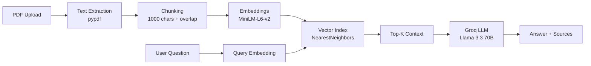

<div align="center">

# 🎓 Smart Study Assistant

**RAG-powered educational chatbot that answers questions from your PDFs in real-time.**

Built with Groq Llama-3.3 · Sentence Transformers · FastAPI · Nearest Neighbor Search

[](https://python.org)
[](https://groq.com)
[](LICENSE)

</div>

---

## ✨ Features

- **📄 PDF Upload** — Drag-and-drop PDF upload with automatic text extraction and chunking
- **🔍 RAG Retrieval** — Sentence Transformer embeddings + Nearest Neighbor search for context retrieval
- **🤖 Groq LLM** — Lightning-fast inference with Llama 3.3 70B via Groq API
- **💬 Real-time Chat** — Beautiful dark-themed chat interface with markdown rendering
- **📊 Source Citations** — Every answer includes relevance-scored source citations
- **🎨 Premium UI** — Custom-built frontend with animations, typing indicators, and responsive design
- **🔒 Security** — Rate limiting, path traversal protection, prompt injection guards, CORS restrictions

---

## 🏗️ Architecture



---

## 🚀 Quick Start

### 1. Clone & Install

```bash
git clone https://github.com/adarsh762/Smart-Study-Assistant.git
cd Smart-Study-Assistant
pip install -r requirements.txt
```

### 2. Set up API Key

```bash
cp .env.example .env
# Edit .env and add your Groq API key
# Get one free at https://console.groq.com/keys
```

### 3. Add PDFs

Drop your course PDFs into the `data/` folder, or upload via the UI.

### 4. Run

```bash
python app.py
```

Open your browser:
- **Frontend**: [http://localhost:7860](http://localhost:7860)
- **Gradio UI**: [http://localhost:7860/gradio](http://localhost:7860/gradio)
- **API Docs**: [http://localhost:7860/docs](http://localhost:7860/docs) *(dev mode only)*
- **Health Check**: [http://localhost:7860/health](http://localhost:7860/health)

---

## 📁 Project Structure

```
smart-study-assistant/
├── app.py              # FastAPI + Gradio entry point
├── config.py           # Centralized settings
├── core/
│   ├── pdf_loader.py   # PDF parsing + chunking + magic validation
│   ├── embeddings.py   # Sentence Transformer indexing
│   ├── retriever.py    # Nearest neighbor search
│   └── llm.py          # Groq API wrapper + prompt injection guard
├── frontend/
│   └── index.html      # Premium chat UI
├── data/               # PDF storage (gitignored)
├── index/              # Persisted embeddings (gitignored)
├── requirements.txt
├── .env.example
└── .gitignore
```

---

## 🛠️ API Endpoints

| Method | Endpoint | Description |
|--------|----------|-------------|
| `GET`  | `/`      | Serve frontend UI |
| `GET`  | `/health`| Health check (for deployment platforms) |
| `POST` | `/api/chat` | Send a question, get RAG answer |
| `POST` | `/api/upload` | Upload a PDF file (max 20 MB) |
| `GET`  | `/api/status` | Get index stats |
| `GET`  | `/docs`  | Swagger API docs *(dev mode only)* |

### Chat Example

```bash
curl -X POST http://localhost:7860/api/chat \
  -H "Content-Type: application/json" \
  -d '{"question": "What is machine learning?", "top_k": 3}'
```

---

## ⚙️ Environment Variables

| Variable | Default | Description |
|----------|---------|-------------|
| `GROQ_API_KEY` | *(required)* | Your Groq API key |
| `ENV` | `development` | Set to `production` to disable API docs and add CSP headers |
| `HOST` | `127.0.0.1` | Server bind address (`0.0.0.0` for public) |
| `PORT` | `7860` | Server port |
| `ALLOWED_ORIGINS` | `http://localhost:7860,...` | Comma-separated CORS origins |

---

## 🔒 Security Features

- **Rate Limiting** — Per-IP limits on chat (30/min) and upload (5/min) endpoints
- **Path Traversal Protection** — Uploaded filenames are sanitized and destination validated
- **Prompt Injection Guard** — Common injection patterns are detected and blocked
- **Output Filtering** — LLM responses are scanned for API key leaks and system prompt echoes
- **PDF Validation** — Magic byte (`%PDF`) check + extension check before processing
- **File Size Limit** — 20 MB max upload size
- **Security Headers** — X-Content-Type-Options, X-Frame-Options, CSP (production mode)
- **CORS Restrictions** — Only configured origins allowed (not `*`)
- **Thread-Safe Index** — Mutex lock prevents concurrent rebuild corruption

---

## ⚙️ Tech Stack

| Component | Technology |
|-----------|-----------|
| **LLM** | Groq API (Llama 3.3 70B Versatile) |
| **Embeddings** | Sentence Transformers (all-MiniLM-L6-v2) |
| **Retrieval** | scikit-learn NearestNeighbors (cosine) |
| **PDF Parsing** | pypdf |
| **Backend** | FastAPI + Uvicorn |
| **Alt UI** | Gradio |
| **Frontend** | Vanilla HTML/CSS/JS |

---

## 📝 License

MIT License — feel free to use, modify, and distribute.

---

<div align="center">
  <sub>Built by <strong>Adarshdev Singh Pawar</strong> · Internship Capstone Project</sub>
</div>
